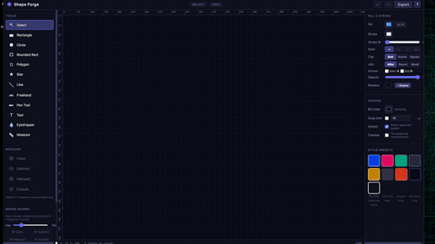
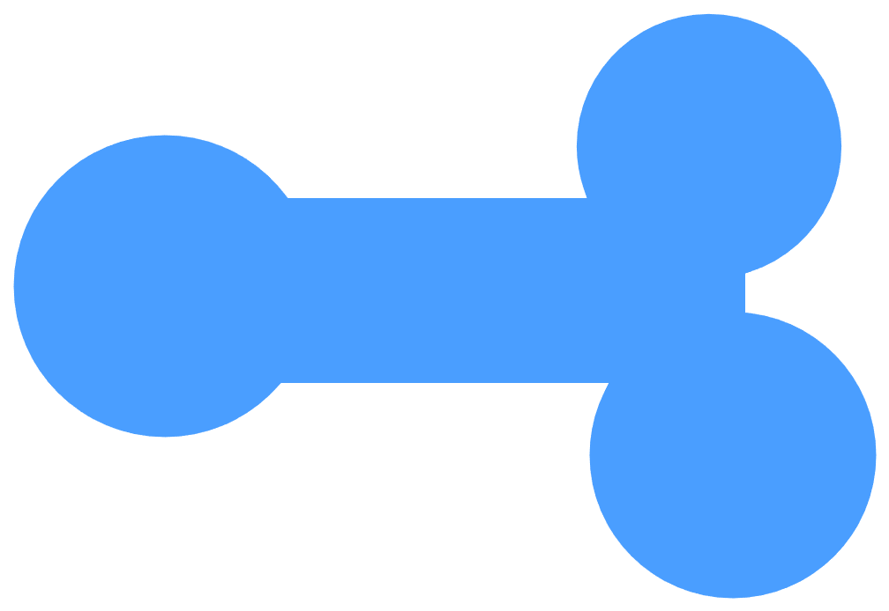
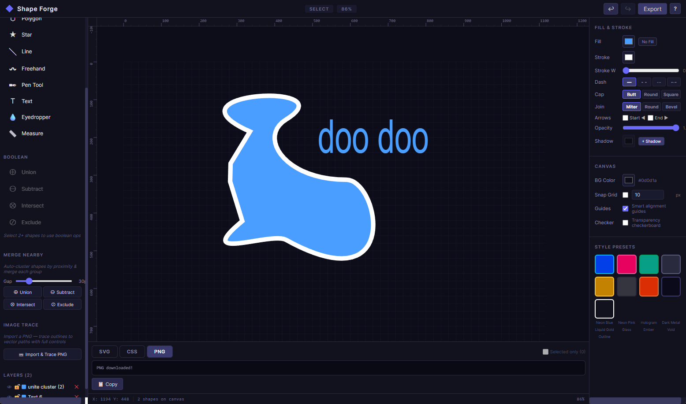

# Shape Forge

A browser-based vector graphics editor built with Paper.js, React, and TypeScript. Create, edit, and export vector shapes — including an advanced PNG-to-vector auto-tracer powered by the marching squares algorithm.







## Quick Examples

### 1) Trace an image into editable vector paths
1. Click **Import & Trace PNG** (supports PNG, JPEG, WebP, GIF)
2. Pick a channel (**Alpha**, **Luminance**, **Red**, **Green**, or **Blue**)
3. Tune the sliders (Threshold, Blur, Smoothing, Min Area, Offset, Corner Angle)
4. Toggle individual contours on/off, then **Apply** to create editable vector paths

### 2) Build shapes with boolean operations
1. Draw primitives (Rectangle / Circle / Polygon / Star)
2. Select 2+ shapes
3. Use **Union / Subtract / Intersect / Exclude** to combine them, or **Merge Nearby** to auto-cluster by proximity

### 3) Export for the web
1. Export **SVG** or **PNG** for the full canvas, or check **Selected only** to export just your selection
2. Use the **CSS** tab to copy a ready-to-paste `clip-path` rule

## Features

### Drawing Tools
- **Rectangle (R), Circle (O), Rounded Rect, Polygon, Star** — click-and-drag creation; Shift to constrain to square/circle
- **Line (L)** — straight line segments with optional arrowheads
- **Freehand (N)** — free-draw smooth paths with round cap/join
- **Pen Tool (P)** — click to add anchor points, drag to pull bezier handles; click near first point to close
- **Text (T)** — click anywhere to place editable text; control content, font size, and font family in the Properties Panel
- **Eyedropper (I)** — click any shape to sample its fill/stroke into the current style; auto-returns to Select
- **Measure Distance (M)** — click two points to display pixel distance with an auto-clearing overlay
- **Selection (V)** — click to select, Shift-click to multi-select, drag empty canvas for marquee/rubber-band selection

### Node Edit Mode
- **Double-click** any path or compound path to enter node edit mode
- **Drag segment points** (squares = corner nodes, circles = smooth nodes)
- **Drag bezier handles** (orange) to reshape curves; handles mirror automatically unless **Alt** is held to break symmetry
- **Click on a path's stroke** to insert a new node at that exact location
- **Escape** to exit node edit and return to shape mode

### Boolean Operations
- **Union, Subtract, Intersect, Exclude** — applied to all selected shapes at once
- **Merge Nearby** — auto-detects proximity clusters with an adjustable gap slider (0–150 px) and merges each cluster with your chosen boolean op

### Transform & Selection
- **8-point resize handles** — drag any corner or edge handle; **Shift** to constrain proportions
- **Rotation handle** — circle above the selection bounding box; **Shift** snaps to 15° increments
- **Alt+Drag** — duplicates all selected shapes and moves the copies in one gesture
- **Flip Horizontal / Flip Vertical** — one-click mirror transform
- **Simplify Path** — reduce node count while preserving shape outline
- **Lock/Unlock aspect ratio** — toggle before entering W/H values in the Properties Panel
- **Nudge** — Arrow keys move 1 px; Shift+Arrow moves 10 px
- **Bring Forward / Send Backward / Bring to Front / Send to Back** (Ctrl+] / Ctrl+[ and context menu)

### Alignment & Distribution
- **Align**: Left, Center H, Right, Top, Center V, Bottom — requires 2+ shapes selected
- **Distribute**: Horizontally or Vertically — requires 3+ shapes selected (evenly spaces centers)

### Groups
- **Group (Ctrl+G)** — combine selected shapes into a group
- **Ungroup (Ctrl+Shift+G)** — dissolve group back into individual shapes

### Primitive Shape Live Editing
- **Rounded Rect** — corner radius slider (0–200 px)
- **Polygon** — side count slider (3–100 sides)
- **Star** — points slider, inner radius, and outer radius sliders

### Text
- Click-to-place text labels on the canvas
- Edit content, font size (8–500 pt), and font family (11 choices including Arial, Georgia, Courier New, monospace) from the Properties Panel

### PNG Auto-Tracer
- **Marching squares contour extraction** with saddle-point disambiguation
- **Multi-channel** — trace from Alpha, Luminance, Red, Green, or Blue
- **Accepts** PNG, JPEG, WebP, and GIF
- **Gaussian blur preprocessing** for noise reduction
- **Live preview modal** with checkerboard background and colored contour overlay
- **Per-contour controls** — enable/disable or delete individual contours
- **6 parameter sliders** — Threshold, Blur, Smoothing, Min Area, Offset, Corner Angle
- **Invert toggle** for negative-space tracing
- **Winding order detection** — automatic outer-contour vs hole classification

### Style & Appearance
- **Fill** — color picker with one-click No Fill / restore fill toggle
- **Stroke** — color, width (0–20), and per-cap/join controls (Butt/Round/Square, Miter/Round/Bevel)
- **Dash patterns** — Solid, Dashed, Dotted, Dash-dot
- **Arrow markers** — enable arrowheads at Start and/or End of any path
- **Opacity** — per-shape opacity slider (0–1)
- **Drop shadow** — toggle shadow with color, blur (0–50), and X/Y offset (±30) controls
- **Style presets** — 9 one-click presets: Neon Blue, Neon Pink, Hologram, Dark Metal, Liquid Gold, Glass, Ember, Void, Outline
- **Recent colors palette** — last 12 used colors; left-click applies to fill, right-click applies to stroke

### Canvas & Navigation
- **Infinite canvas** — pan with Space+drag or middle-click drag; zoom to cursor with scroll wheel
- **Rulers** — horizontal and vertical pixel rulers with zoom-adaptive major/minor tick labels
- **Smart alignment guides** — magenta snap lines appear when dragging shapes near edges or centers of others
- **Snap-to-grid** — configurable grid size with dot overlay
- **Canvas background color** — editable color picker in the Properties Panel
- **Checkerboard transparency** — toggle CSS checkerboard background to check opacity
- **Marquee selection** — drag on empty canvas to rubber-band select multiple shapes
- **DPI-aware rendering** — full `devicePixelRatio` support for sharp display on HiDPI/Retina screens
- **Status bar** — live cursor X/Y, shape count / selection info, and zoom % at the bottom of the canvas
- **F** — zoom to fit selection (or all shapes if nothing selected)
- **Ctrl+0** — fit canvas to view; **Ctrl+1** — zoom to 100%; **Ctrl+=** / **Ctrl+-** — zoom in/out; **Home** — reset to 0,0 @ 100%

### Export
- **SVG** — clean vector output; copy to clipboard or download as `.svg`
- **PNG** — rasterised output at 2× resolution; auto-downloads as `.png`
- **CSS clip-path** — ready-to-paste `clip-path: path(…)` rule
- **Selected only** checkbox — export just the currently selected shapes for any format

### Clipboard & History
- **Copy / Cut / Paste** (Ctrl+C / Ctrl+X / Ctrl+V) — internal clipboard with offset-on-repeated-paste
- **Duplicate** (Ctrl+D) — in-place copy offset by 20 px
- **SVG paste** — paste raw SVG markup from clipboard and it imports directly onto the canvas, centered in view
- **Undo / Redo** — 50-step history stack (Ctrl+Z / Ctrl+Shift+Z)

### Layers Panel
- **Visibility toggle** (👁) and **Lock toggle** (🔒) per layer
- **Color swatch** — shows the layer's current fill at a glance
- **Drag-to-reorder** — drag any layer row above or below another to change stacking order
- **Double-click to rename** — inline rename with Enter to confirm / Escape to cancel
- **Delete** button per layer

### Right-click Context Menu
- Cut, Copy, Paste, Duplicate, Delete, Select All
- Bring Forward, Send Backward, Bring to Front, Send to Back
- Group / Ungroup

### Keyboard Shortcuts Help
- Press **?** anywhere to open a full keyboard shortcuts overlay covering all tools, edit actions, transforms, canvas navigation, and drawing modifiers

## Getting Started

### Prerequisites
- [Node.js](https://nodejs.org/) 18+
- npm (comes with Node.js)

### Install & Run

```bash
git clone https://github.com/newjordan/shape-forge.git
cd shape-forge
npm install
npm run dev
```

Open [http://localhost:5173](http://localhost:5173) in your browser.

### Build for Production

```bash
npm run build
npm run preview
```

## Tech Stack

| Layer | Technology |
|-------|-----------|
| UI Framework | [React](https://react.dev/) 19 |
| Language | [TypeScript](https://www.typescriptlang.org/) 5.9 |
| Build Tool | [Vite](https://vite.dev/) 7 |
| Vector Engine | [Paper.js](http://paperjs.org/) 0.12 |
| State Management | [Zustand](https://zustand.docs.pmnd.rs/) 5 |

## Project Structure

```
src/
├── App.tsx                    # Root component, layout, modal wiring
├── engine.ts                  # Paper.js engine, shape ops, trace pipeline
├── store.ts                   # Zustand state management
├── types.ts                   # TypeScript type definitions
├── main.tsx                   # Entry point
├── index.css                  # Global styles
└── components/
    ├── Canvas.tsx             # Main canvas with Paper.js rendering
    ├── Toolbar.tsx            # Left sidebar tools & controls
    ├── PropertiesPanel.tsx    # Right panel transform & style controls
    ├── ImageTraceModal.tsx    # PNG trace popup with live preview
    └── ExportPanel.tsx        # SVG/PNG export controls
```

## Export Examples

Shapes created in Shape Forge can be exported as SVG and used directly in CSS via `clip-path`:

### CSS `clip-path` Usage

```css
/* Shape Forge Export */
.shape-element {
  width: 300px;
  height: 300px;
  background: linear-gradient(135deg, #4a9eff, #0044ff);
  clip-path: path('M122.26716,360.5c0,-49.28194 39.9509,-89.23284 89.23284,-89.23284c29.21156,0 55.1447,14.03655 71.42261,35.73284h162.91294c-2.85278,-8.13791 -4.404,-16.8878 -4.404,-26c0,-43.39215 35.17629,-78.56844 78.56844,-78.56844c43.39215,0 78.56844,35.17629 78.56844,78.56844c0,35.02194 -22.91438,64.69195 -54.56844,74.83531v16.55911c41.85141,5.1715 74.24963,40.85503 74.24963,84.10558c0,46.80593 -37.9437,84.74963 -84.74963,84.74963c-46.80593,0 -84.74963,-37.9437 -84.74963,-84.74963c0,-13.46406 3.13971,-26.1948 8.72692,-37.5h-178.59411c-16.36025,18.82837 -40.48149,30.73284 -67.38318,30.73284c-49.28194,0 -89.23284,-39.9509 -89.23284,-89.23284z');
  /* Optional effects */
  /* box-shadow: 0 0 30px rgba(74, 158, 255, 0.4); */
  /* backdrop-filter: blur(10px); */
}
```

### Raw SVG Output

```xml
<g xmlns="http://www.w3.org/2000/svg" id="draw" fill="none" fill-rule="nonzero"
   stroke="none" stroke-width="none" stroke-linecap="butt" stroke-linejoin="miter"
   stroke-miterlimit="10" stroke-dasharray="none" stroke-dashoffset="0"
   style="mix-blend-mode: normal">
  <path d="M122.26716,360.5c0,-49.28194 39.9509,-89.23284 89.23284,-89.23284
    c29.21156,0 55.1447,14.03655 71.42261,35.73284h162.91294
    c-2.85278,-8.13791 -4.404,-16.8878 -4.404,-26
    c0,-43.39215 35.17629,-78.56844 78.56844,-78.56844
    c43.39215,0 78.56844,35.17629 78.56844,78.56844
    c0,35.02194 -22.91438,64.69195 -54.56844,74.83531v16.55911
    c41.85141,5.1715 74.24963,40.85503 74.24963,84.10558
    c0,46.80593 -37.9437,84.74963 -84.74963,84.74963
    c-46.80593,0 -84.74963,-37.9437 -84.74963,-84.74963
    c0,-13.46406 3.13971,-26.1948 8.72692,-37.5h-178.59411
    c-16.36025,18.82837 -40.48149,30.73284 -67.38318,30.73284
    c-49.28194,0 -89.23284,-39.9509 -89.23284,-89.23284z"
    fill="#4a9eff" stroke="#ffffff" stroke-width="7"/>
</g>
```

## Contributing

Contributions are welcome! Please:

1. Fork the repository
2. Create a feature branch (`git checkout -b feat/my-feature`)
3. Commit your changes (`git commit -m 'feat: add my feature'`)
4. Push to the branch (`git push origin feat/my-feature`)
5. Open a Pull Request

Please use [Conventional Commits](https://www.conventionalcommits.org/) for commit messages.

## License

[MIT](LICENSE)