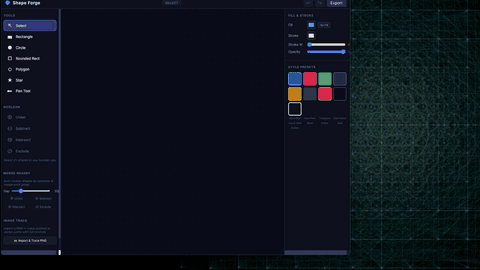

# Shape Forge

A browser-based vector graphics editor built with Paper.js, React, and TypeScript. Create, edit, and export vector shapes — including an advanced PNG-to-vector auto-tracer powered by the marching squares algorithm.



> *30-second preview — [watch the full demo video](docs/shape_forge.mp4)*


## Features

### Drawing Tools
- **Rectangle, Circle, Rounded Rectangle, Polygon, Star** — click-and-drag shape creation
- **Pen Tool** — node-level editing with bezier curve manipulation
- **Selection Tool** — click to select, drag to move, multi-select support

### Boolean Operations
- **Union, Subtract, Intersect, Exclude** — combine shapes with boolean ops
- **Merge Nearby** — auto-merge overlapping shapes within a configurable radius

### PNG Auto-Tracer
- **Marching squares contour extraction** with saddle point disambiguation
- **Multi-channel support** — trace from Alpha, Luminance, Red, Green, or Blue
- **Gaussian blur preprocessing** for noise reduction
- **Live preview modal** with checkerboard background and colored contour overlay
- **Per-contour controls** — enable/disable, delete individual contours
- **6 parameter sliders** — Threshold, Blur, Smoothing, Min Area, Offset, Corner Angle
- **Negative space tracing** via invert toggle
- **Winding order detection** — automatic outer contour vs hole classification

### Canvas & Navigation
- **Infinite canvas** with pan (middle-click or Space+drag) and zoom (scroll wheel)
- **Snap-to-grid** with configurable grid size
- **F key** — zoom-to-fit on selection (or all shapes)
- **Undo/Redo** with full history stack

### Export
- **SVG export** — clean vector output
- **PNG export** — rasterized output at configurable resolution

### Properties Panel
- **Transform controls** — position, size, rotation
- **Fill & Stroke** — color pickers, stroke width, opacity
- **Layer management** — visibility, lock, reorder, rename

## Getting Started

### Prerequisites
- [Node.js](https://nodejs.org/) 18+ 
- npm (comes with Node.js)

### Install & Run

```bash
git clone https://github.com/newjordan/shape-forge.git
cd shape-forge
npm install
npm run dev
```

Open [http://localhost:5173](http://localhost:5173) in your browser.

### Build for Production

```bash
npm run build
npm run preview
```

## Tech Stack

| Layer | Technology |
|-------|-----------|
| UI Framework | [React](https://react.dev/) 19 |
| Language | [TypeScript](https://www.typescriptlang.org/) 5.9 |
| Build Tool | [Vite](https://vite.dev/) 7 |
| Vector Engine | [Paper.js](http://paperjs.org/) 0.12 |
| State Management | [Zustand](https://zustand.docs.pmnd.rs/) 5 |

## Project Structure

```
src/
├── App.tsx                    # Root component, layout, modal wiring
├── engine.ts                  # Paper.js engine, shape ops, trace pipeline
├── store.ts                   # Zustand state management
├── types.ts                   # TypeScript type definitions
├── main.tsx                   # Entry point
├── index.css                  # Global styles
└── components/
    ├── Canvas.tsx             # Main canvas with Paper.js rendering
    ├── Toolbar.tsx            # Left sidebar tools & controls
    ├── PropertiesPanel.tsx    # Right panel transform & style controls
    ├── ImageTraceModal.tsx    # PNG trace popup with live preview
    └── ExportPanel.tsx        # SVG/PNG export controls
```

## Export Examples

Shapes created in Shape Forge can be exported as SVG and used directly in CSS via `clip-path`:

### CSS `clip-path` Usage

```css
/* Shape Forge Export */
.shape-element {
  width: 300px;
  height: 300px;
  background: linear-gradient(135deg, #4a9eff, #0044ff);
  clip-path: path('M122.26716,360.5c0,-49.28194 39.9509,-89.23284 89.23284,-89.23284c29.21156,0 55.1447,14.03655 71.42261,35.73284h162.91294c-2.85278,-8.13791 -4.404,-16.8878 -4.404,-26c0,-43.39215 35.17629,-78.56844 78.56844,-78.56844c43.39215,0 78.56844,35.17629 78.56844,78.56844c0,35.02194 -22.91438,64.69195 -54.56844,74.83531v16.55911c41.85141,5.1715 74.24963,40.85503 74.24963,84.10558c0,46.80593 -37.9437,84.74963 -84.74963,84.74963c-46.80593,0 -84.74963,-37.9437 -84.74963,-84.74963c0,-13.46406 3.13971,-26.1948 8.72692,-37.5h-178.59411c-16.36025,18.82837 -40.48149,30.73284 -67.38318,30.73284c-49.28194,0 -89.23284,-39.9509 -89.23284,-89.23284z');
  /* Optional effects */
  /* box-shadow: 0 0 30px rgba(74, 158, 255, 0.4); */
  /* backdrop-filter: blur(10px); */
}
```

### Raw SVG Output

```xml
<g xmlns="http://www.w3.org/2000/svg" id="draw" fill="none" fill-rule="nonzero"
   stroke="none" stroke-width="none" stroke-linecap="butt" stroke-linejoin="miter"
   stroke-miterlimit="10" stroke-dasharray="none" stroke-dashoffset="0"
   style="mix-blend-mode: normal">
  <path d="M122.26716,360.5c0,-49.28194 39.9509,-89.23284 89.23284,-89.23284
    c29.21156,0 55.1447,14.03655 71.42261,35.73284h162.91294
    c-2.85278,-8.13791 -4.404,-16.8878 -4.404,-26
    c0,-43.39215 35.17629,-78.56844 78.56844,-78.56844
    c43.39215,0 78.56844,35.17629 78.56844,78.56844
    c0,35.02194 -22.91438,64.69195 -54.56844,74.83531v16.55911
    c41.85141,5.1715 74.24963,40.85503 74.24963,84.10558
    c0,46.80593 -37.9437,84.74963 -84.74963,84.74963
    c-46.80593,0 -84.74963,-37.9437 -84.74963,-84.74963
    c0,-13.46406 3.13971,-26.1948 8.72692,-37.5h-178.59411
    c-16.36025,18.82837 -40.48149,30.73284 -67.38318,30.73284
    c-49.28194,0 -89.23284,-39.9509 -89.23284,-89.23284z"
    fill="#4a9eff" stroke="#ffffff" stroke-width="7"/>
</g>
```

## Contributing

Contributions are welcome! Please:

1. Fork the repository
2. Create a feature branch (`git checkout -b feat/my-feature`)
3. Commit your changes (`git commit -m 'feat: add my feature'`)
4. Push to the branch (`git push origin feat/my-feature`)
5. Open a Pull Request

Please use [Conventional Commits](https://www.conventionalcommits.org/) for commit messages.

## License

[MIT](LICENSE)
